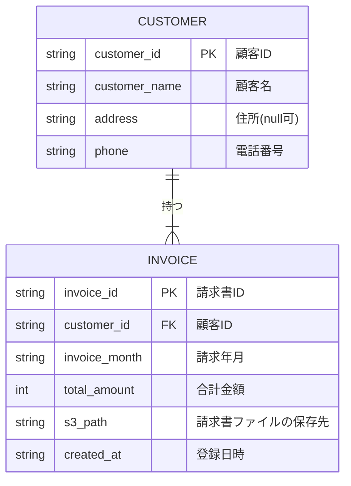
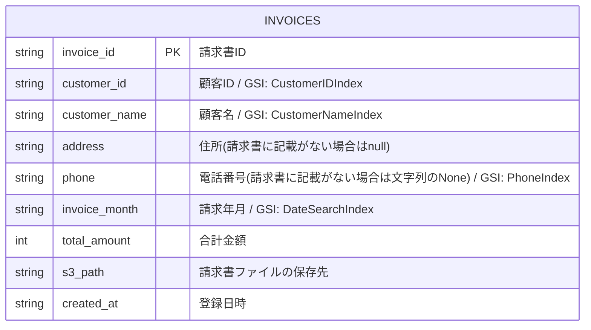

## 論理ER図

```mermaid
erDiagram
    CUSTOMER ||--|{ INVOICE : "持つ"

    CUSTOMER {
        string customer_id PK "顧客ID"
        string customer_name "顧客名"
        string address "住所(null可)"
        string phone "電話番号"
    }

    INVOICE {
        string invoice_id PK "請求書ID"
        string customer_id FK "顧客ID"
        string invoice_month "請求年月"
        int total_amount "合計金額"
        string s3_path "請求書ファイルの保存先"
        string created_at "登録日時"
    }
```

## 物理テーブル図

```mermaid
erDiagram
    INVOICES {
        string invoice_id PK "請求書ID"
        string customer_id "顧客ID / GSI: CustomerIDIndex"
        string customer_name "顧客名 / GSI: CustomerNameIndex"
        string address "住所(請求書に記載がない場合はnull)"
        string phone "電話番号(請求書に記載がない場合は文字列のNone) / GSI: PhoneIndex"
        string invoice_month "請求年月 / GSI: DateSearchIndex"
        int total_amount "合計金額"
        string s3_path "請求書ファイルの保存先"
        string created_at "登録日時"
    }
```
